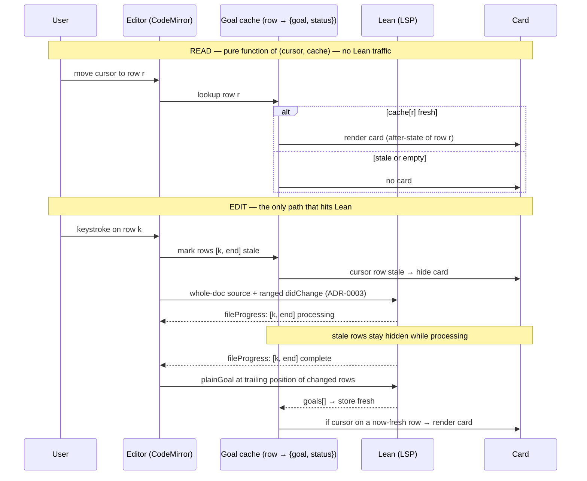

# ADR-0004: Goal state as cursor-anchored, cache-backed after-state cards

**Status:** Proposed
**Date:** 2026-06-19
**Deciders:** W.P. McNeill
**Epic:** [#88](https://github.com/wpm/Turnstile/issues/88)

## Context

The value of Turnstile, once the app is used in earnest, is that one proof is visible in three coordinated registers at once: the **formal** Lean source, the **goal state** Lean computes for it, and the **prose** narrative. Reading left to right is reading from the most formal account of the proof to the most informal one, and the goal state is the hinge between them — it is what each tactic line actually accomplished, stated in Lean's own terms, halfway between the code and the prose. The current UI does not let a reader hold all three at once, and the goal state it does show is coarse.

Three facts about the present implementation create the problem:

- **Goal and prose are mutually exclusive.** The lower-left pane toggles between `GoalState.svelte` and `ProseProof.svelte` via `ProofViewToggle.svelte` (`src/routes/+page.svelte`, a draggable grid keyed on `leftWidth` / `topHeight`). A reader sees one or the other, never goal and prose side by side.

- **The goal state is a single whole-proof blob.** The backend fetches exactly one goal: `fetch_full_proof_goal_state` (`src-tauri/src/lib.rs`) issues <code>&#36;/lean/plainGoal</code> at the end of the document, falling back to <code>&#36;/lean/plainTermGoal</code> at the last non-whitespace character, and emits it as `GoalStateUpdated(GoalStateInfo { full })`. There is no per-line goal; the connection between a specific tactic and the state it produced is left for the reader to infer.

- **Completion is announced, not shown.** When `plainGoal` renders the bare string `"no goals"`, `isProofComplete` (`src/lib/goalState.ts`) trips and `GoalState.svelte` paints "No goals — proof complete." in green (`#16a34a`). This is a banner standing in for information the layout could carry structurally.

Several properties of the Lean LSP shape what is and is not possible:

- **<code>&#36;/lean/plainGoal</code> is position-based, and there is no map.** Goals are obtained by querying a `TextDocumentPositionParams`; nothing in the protocol pushes a `{line → goal}` table. VS Code's infoview re-queries on cursor movement — its apparent "map" is lazy, on-demand querying. The notification that _does_ push a per-range table is <code>&#36;/lean/fileProgress</code> (`FileProgressParams.processing`, consumed today via `FileProgressRange` and `progressHighlightLines` in `src/lib/progress.ts` to drive the `.cm-elaborating` highlight), but it carries _processing state_, not goals.

- **A goal state is a flat list, never a tree.** `plainGoal` returns `{ rendered, goals: string[] }`; each entry is one goal (an optional `case` label, a flat list of hypotheses, a conclusion). Turnstile currently keeps only `rendered` and re-splits it in `parseGoalText`.

- **Under focusing, the list has length one almost everywhere.** Idiomatic tactic proofs stay inside a focused block (`·`, `case`, structured `induction … with`), so the active set at any position is a single goal. The list grows only in the brief _unfocused_ window right after a splitting tactic (`induction n`, `constructor`, `cases`) before a bullet narrows it.

- **A single goal can be tall.** One `goals[]` entry may stack many hypotheses above its `⊢` conclusion. Verticality, not list length, is the dimension that resists per-line alignment.

The central tension is temporal. A goal exists only as a by-product of **elaboration**, which is triggered by **editing**. But the value of the goal — staring at all three registers together — is realized at **read** time, when no editing is happening. Any design that ties goal _display_ to editing activity starves the reader; any design that re-queries Lean on every cursor move during reading pays latency for data that has not changed. The decision below resolves this by separating when a goal is _acquired_ from when it is _displayed_.

This builds on ADR-0003, which made the backend the single source of truth for the formal proof and its annotations, with versioning enforced by `Protocol::next_version` and stale notifications dropped by `keep_notification`. The goal cache introduced here is a new annotation-like artifact that lives under the same authority and obeys the same versioning.

## Decision

1. **Layout becomes a horizontal split.** The upper half holds the Formal Proof (left) and the Prose Proof (right), side by side; the lower half holds the Proof Assistant at full width, unchanged. Dividers remain draggable. The Prose pane defaults to the Prose Proof, but the toggle button is retained so it can switch between the prose and the entire goal list (see decision 7).

2. **Goal state is shown as a single card anchored to the cursor's row**, rendered inside the Formal pane with its **right edge pinned to a thin vertical separator rail** between code and prose. The card grows **leftward and downward** only, so by construction it never crosses the rail into the Prose pane. A small cosmetic gutter separates the panes. The rail is the spine the goal hangs from; an unfocused multi-goal moment is marked as a small `+N` notch on it.

3. **The card shows the _after_-state**: the goal at the row's **trailing** position (<code>&#36;/lean/plainGoal</code> queried at the end of the row's content), answering "what did this row get me?". This deliberately fixes a row-level convention that the position-based LSP does not itself impose — and it means that on a goal-closing line the card shows what _remains_ (the sibling goal, or nothing), not the goal that line dispatched.

4. **Acquisition and display are separated by a per-row cache.** The cache is `row → { goal, status }` with `status ∈ { fresh, stale, empty }`. **Display is a pure function of `(cursor row, cache)`: the card renders if and only if `cache[cursorRow].status == fresh`.** Reading never touches Lean; moving the cursor over already-elaborated rows is instant and silent.

5. **Acquisition is edit-driven and `fileProgress`-gated.** On an edit at row _k_, the cache marks rows `[k, end]` `stale` (a card on a stale row hides immediately — no goal flickers mid-keystroke). The whole document is assigned to the backend `source` and a ranged `didChange` is forwarded to the LSP (per ADR-0003). As <code>&#36;/lean/fileProgress</code> reports rows back to complete, Turnstile re-queries `plainGoal` at the trailing position of the changed rows and stores them `fresh`. **Invalidation is downward-inclusive** — editing row _k_ stales `[k, end]`, never anything above — because every tactic depends on the ones before it. Re-query is **scoped to the changed tail and populated eagerly** in the background, so every later cursor move and panel open is served from cache.

6. **The backend deserializes `goals: string[]` directly** rather than keeping `rendered` and re-splitting it. The per-row goal carries structure (case label, hypotheses, conclusion) from the source, removing the fragile blank-line splitting in `parseGoalText`.

7. **An "All Goals" view is retained behind the existing toggle.** The top-right pane swaps Prose ⇄ All-Goals on demand, rendering the entire cache at once for the reader who wants the whole stack. The green "proof complete" banner is removed; a closed proof simply runs out of goals, shown as a quiet closed-state on the relevant card.

8. **Focused tactic-mode is the explicit target.** Turnstile is documented as a tool for focused, tactic-mode proofs. Term-mode degrades gracefully — the per-row ladder is empty and the prose carries the proof — and an empty `plainGoal` on a non-trivial document surfaces a one-time hint rather than an error.

### Goal lifecycle

## Options Considered

### Presentation model

| Option                            | Shape                                      | Assessment                                                                                                                                                                                                                       |
| --------------------------------- | ------------------------------------------ | -------------------------------------------------------------------------------------------------------------------------------------------------------------------------------------------------------------------------------- |
| Toggled whole-proof panel (today) | one goal, mutually exclusive with prose    | Cannot show goal and prose together; a single end-of-document goal severs the per-line tactic→state link that is the whole point.                                                                                                |
| Static per-line ladder            | every row's goal rendered at once, aligned | Realizes the "connector" vision maximally, but a tall single goal cannot align to a one-row source line without either stretching the source or colliding with its neighbors, and live per-line querying is N requests per edit. |
| **Cursor-anchored card (chosen)** | one goal, the cursor row's, rail-pinned    | Shows goal beside prose; one goal at a time means a tall goal is free to be tall; exact alignment is trivial (one row). The all-at-once need is met separately by the toggle, read from the same cache.                          |

### Acquisition timing

| Option                                                  | When queried                       | Assessment                                                                                                                                           |
| ------------------------------------------------------- | ---------------------------------- | ---------------------------------------------------------------------------------------------------------------------------------------------------- |
| Live per-line (with the ladder)                         | every row, every edit              | N `plainGoal` calls per keystroke; the cost that sinks the static ladder.                                                                            |
| Lazy cursor-only                                        | the cursor row, on arrival         | Minimal queries, but the first visit to each row during reading pays a query's latency and can flicker.                                              |
| **Edit-driven, eager changed-tail into cache (chosen)** | `[k, end]` after each edit settles | Re-queries only what an edit could have changed, in the background; every read is then cache-served and instant. Decouples display from acquisition. |

### Position convention

| Option                   | Card shows                          | Assessment                                                                                                                                                                                                                |
| ------------------------ | ----------------------------------- | ------------------------------------------------------------------------------------------------------------------------------------------------------------------------------------------------------------------------- |
| Before-state             | goal entering the row's tactic      | "What must I prove here." Matches a cursor parked at the start of the line.                                                                                                                                               |
| **After-state (chosen)** | goal at the row's trailing position | "What did this row get me." Matches a cursor at end-of-line (the common stepping position) and makes a closing line show what remains; the proof visibly runs out of goals at the bottom, retiring the completion banner. |

## Trade-off Analysis

The cache is what makes the choice coherent. Separating acquisition from display dissolves the temporal tension directly: goals are produced when Lean produces them (on elaboration, after an edit) and consumed whenever the reader looks, because the produced value is retained. The display rule reduces to a lookup — `card ⇔ cache[cursorRow].fresh` — with no Lean round-trip on the read path, so "sit and stare at all three registers" costs nothing, and "type and watch the goal update" is correct because a stale row shows nothing until its goal is genuinely recomputed.

The cursor-card beats both the toggled panel and the static ladder by taking the strongest part of each and paying neither's price. From the ladder it keeps the goal _at_ the line that earned it, pinned to the rail as a visual hinge to the prose; but by showing only the cursor row it sidesteps the two facts that make a full ladder infeasible — that a single goal can be arbitrarily tall, and that rendering every row's goal demands per-line querying. The reader who genuinely wants the whole stack is not abandoned: the All-Goals toggle renders the entire cache at once, for free, because acquisition already populated it.

Eager changed-tail acquisition is preferred over lazy cursor-only acquisition because the dominant interaction is reading, not first-touch: a reader walks the cursor down a finished proof and every step should be instant. The extra queries are bounded by the edit's blast radius (`[k, end]`, never the whole document), run off the hot path after `fileProgress` reports completion, and are exactly the queries the All-Goals panel would need anyway. This reuses the machinery ADR-0003 already established — whole-document source assignment with a ranged `didChange` to the LSP, ordered by `Protocol::next_version` and filtered by `keep_notification` — so the goal cache inherits a working invalidation and staleness story rather than inventing one. `fileProgress`, already consumed to drive the elaboration highlight, does double duty as the cache's stale/refill signal: its `processing` ranges are precisely the cache entries to invalidate, and its completions are the triggers to refill.

The after-state convention is chosen for its reading semantics, accepting one consequence deliberately: on a line that closes a goal, the card reports what remains rather than the goal just discharged. This is correct for "where am I now," is internally consistent, and yields the retirement of the green banner as a side benefit — a closed proof shows an empty closed-state at the bottom of the cursor's descent instead of a separate announcement.

## Consequences

- **Easier:** goal and prose are visible together; the per-line tactic→state link is explicit at the cursor; reading is Lean-free and instant; the All-Goals panel and the card are two renderings of one cached fact and cannot disagree; the completion banner and the `isProofComplete` special case give way to a structural empty-state; per-row goals carry real structure from `goals[]` instead of re-split `rendered` text.
- **Harder:** the backend gains a per-row goal cache with downward-inclusive invalidation driven by `fileProgress`, replacing the single end-of-document fetch in `fetch_full_proof_goal_state`; the `GoalStateUpdated` / `GoalStateInfo { full }` wire shape becomes per-row; the Formal pane must render a rail-pinned CodeMirror widget that grows left/down and handles the long-cursor-line collision (drop below the line, or dim while typing on it); the layout grid in `+page.svelte` is reworked from the toggled lower-left pane to the horizontal split.
- **To revisit:** performance of changed-tail re-query. The implementation should do the simplest thing — re-query every row in the invalidated tail `[k, end]` once `fileProgress` reports it complete, no batching or throttling — and optimize only if that proves too slow on large proofs, detectable via the same version counter that already guards annotation freshness. Note that hover-to-peek for the full goal is explicitly **not** pursued: hover over the Formal pane is already claimed by Lean's source diagnostics (`src/lib/hover.ts`, `HoverHit.ts`), so the full goal is reached through the All-Goals toggle, not a hover on the card.

## Action Items

Tracked under epic [#88](https://github.com/wpm/Turnstile/issues/88).
